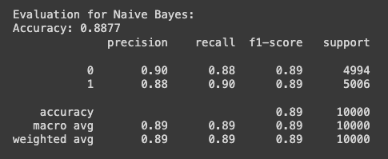
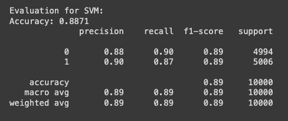
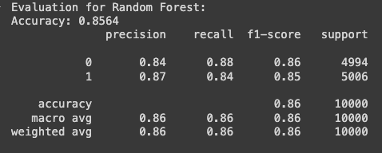

# Sentiment Analysis on IMDB Dataset

This project performs sentiment analysis on the IMDB movie review dataset using Natural Language Processing (NLP) techniques for data preprocessing and machine learning algorithms for classification. The goal is to classify movie reviews as either positive or negative based on their content.

## Table of Contents
- [Project Overview](#project-overview)
- [Dataset](#dataset)
- [Preprocessing Steps](#preprocessing-steps)
- [Feature Extraction](#feature-extraction)
- [Models Used](#models-used)
- [Evaluation](#evaluation)
- [Libraries and Dependencies](#libraries-and-dependencies)
- [Future Improvements](#future-improvements)

## Project Overview
This project leverages the IMDB dataset to classify movie reviews as positive or negative. The project consists of two main parts:
1. **Data Preprocessing**: Cleaning and preparing the text data.
2. **Model Training and Evaluation**: Training various machine learning models using TF-IDF vectorized features and evaluating their performance.

## Dataset
The dataset used in this project is the IMDB movie review dataset, which contains 50,000 reviews labeled as either positive or negative.

## Preprocessing Steps

The text preprocessing includes:

1. **HTML Parsing**: Remove HTML tags using `BeautifulSoup`.
2. **Tag and Symbol Removal**: Remove unwanted tags like `[br]`, excessive dots, and asterisks using regex.
3. **Contraction Expansion**: Expand contractions like "don't" to "do not" using the `contractions` library.
4. **Text Normalization**: Convert text to ASCII format and remove non-ASCII characters.
5. **Noise Removal**: Remove URLs, mentions, and hashtags.
6. **Character Deduplication**: Reduce repeated characters (e.g., "loooove" becomes "loove").
7. **Non-Alphanumeric Removal**: Remove all non-alphanumeric characters except spaces.
8. **Lowercasing**: Convert the text to lowercase.
9. **Negation Handling**: Handle negations, where words following a negation are prefixed with "NOT_".
10. **Tokenization**: Split text into individual words.
11. **Stopword Removal**: Remove common stopwords like "the", "and", etc.
12. **Lemmatization**: Reduce each word to its base form (e.g., "running" becomes "run").

## Feature Extraction

We used **TF-IDF (Term Frequency-Inverse Document Frequency)** vectorization with an n-gram range of (1, 3) to transform the text data into features suitable for machine learning models.

```python
from sklearn.feature_extraction.text import TfidfVectorizer

# Initialize the TfidfVectorizer with n-gram range (1, 3)
vectorizer = TfidfVectorizer(ngram_range=(1, 3))

# Fit the vectorizer on the training data and transform both training and test data
X_train_tfidf = vectorizer.fit_transform(X_train)
X_test_tfidf = vectorizer.transform(X_test)
```
## Models Used
Three machine learning models were trained on the TF-IDF features:

1. Support Vector Machine (SVM)
2. Naive Bayes (MultinomialNB)
3. Random Forest Classifier
Each model was trained and evaluated based on the accuracy and classification report.
```python
# Initialize and train models
svm_model = SVC()
nb_model = MultinomialNB()
rf_model = RandomForestClassifier()

# Fit models on training data
svm_model.fit(X_train_tfidf, y_train)
nb_model.fit(X_train_tfidf, y_train)
rf_model.fit(X_train_tfidf, y_train)
```
## Evaluation
The models were evaluated using the accuracy score and classification report (precision, recall, f1-score) to measure their performance on the test data.
```python
from sklearn.metrics import classification_report, accuracy_score

# Function to evaluate models
def evaluate_model(y_true, y_pred, model_name):
    print(f"Evaluation for {model_name}:")
    print(f"Accuracy: {accuracy_score(y_true, y_pred):.4f}")
    print(classification_report(y_true, y_pred))

# Evaluate Random Forest
evaluate_model(y_test, y_pred_random_forest, "Random Forest")

# Evaluate SVM
evaluate_model(y_test, y_pred_svm, "SVM")

# Evaluate Naive Bayes
evaluate_model(y_test, y_pred_naive_bayes, "Naive Bayes")
```
Result with Naive Bayes  




Result with SVM




Result with Random Forest



## Libraries and Dependencies
The following libraries were used:

- pandas: Data manipulation and analysis.
- scikit-learn: For machine learning models and evaluation metrics.
- spacy: For NLP preprocessing tasks.
- nltk: For tokenization, stopword removal, and lemmatization.
- BeautifulSoup: For HTML parsing and text cleaning.
- matplotlib and seaborn: For data visualization.

## Future Improvements
- Fine-tune hyperparameters for better model performance.
- Experiment with deep learning models such as LSTMs or transformers.
- Use word embeddings (e.g., Word2Vec, GloVe) instead of TF-IDF for feature extraction.
- Handle more complex cases of negation and sarcasm in reviews.
